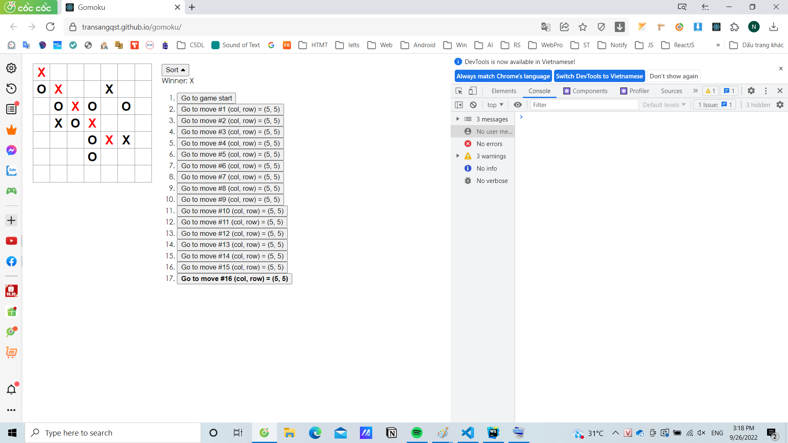
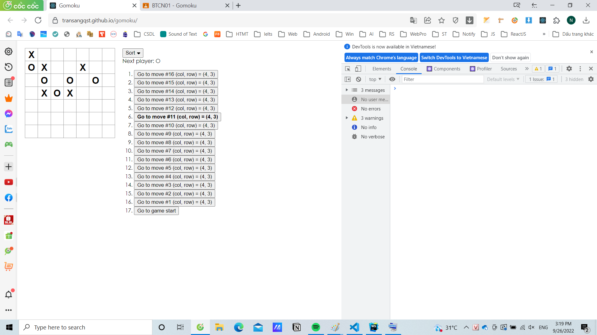
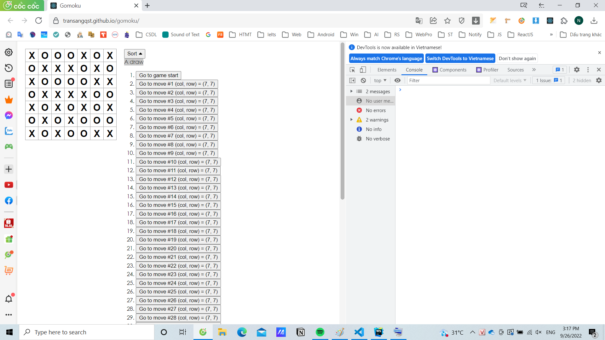

## Thông tin các nhân:

#### MSSV: 19120347

#### Họ tên: Trần Ngọc Sang

### Email: transang0347@gmail.com

### github: https://github.com/TranSangQST/gomoku

#### Tự đánh giá: 10/10

## Hướng dẫn chạy project:

### Tải thư viện:

```
    npm install
```

### Run project:

```
    react-scripts start
```

### Publish hosting:

https://transangqst.github.io/gomoku/

### Demo:

#### 1. Format (col, row) trong history list.

   

#### 2. In đậm bước đang chọn

   

#### 3. Thắng: Đổi luật thắng thành 5 ô liên tục và hiển thị các ô thắng

   
   
#### 4. Hiển thị button sort và sắp xếp cắc bước
   
   
#### 5. Hòa
   
